# Lab Report 1 - Xicotencatl Reyes

## Installing VSCode

* Go to the [Visual Studio Code website](https://code.visualstudio.com/).

 * Install the appropriate VSCode version.

 * Open VSCode and its integrated terminal by doing (Ctrl + `, or use the Terminal -> New Terminal menu option).
   * 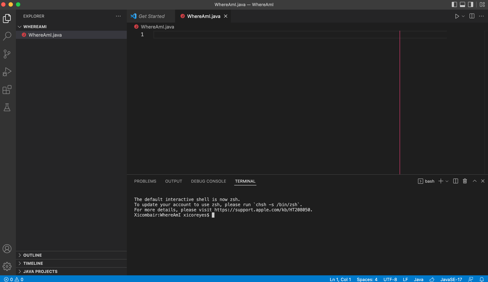

## Remotely Connecting

 * Install OpenSSH if you are on Windows otherwise continue to the next step.

* Look up your course-specific account for CSE15L [here](https://sdacs.ucsd.edu/~icc/index.php)

* Now, to remotely connect use the opened terminal in VSCode to input this command 
  * $ ssh cs15lsp22zz@ieng6.ucsd.edu

* If this is your first time connecting you will be asked if you are sure you want to continue connecting. Input "yes" and enter your designated password for your cs15lsp22 account

* Say yes and then give the password for your account. You have now connected. This should be displayed.
  * 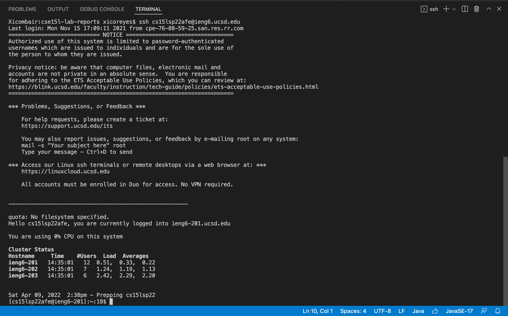

## Trying Some Commands

 * Try some commands in the terminal.
   * cd ~
   * cd
   * ls
     * Ex: 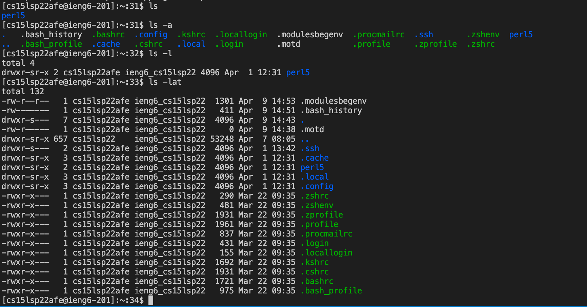

   * ls < directory > where < directory > is /home/linux/ieng6/cs15lsp22/cs15lsp22abc where "abc" is a directory other than your own
   * cp /home/linux/ieng6/cs15lsp22/public/hello.txt ~/
   * cat /home/linux/ieng6/cs15lsp22/public/hello.txt

   * (where hello.txt is an example text file in the directory)

## Moving Files w/ scp

### To move files with scp follow this example "WhereAmI" class in your **local server** i.e (*your own computer, not the cs15lsp22zz@ieng6.ucsd.edu account*).

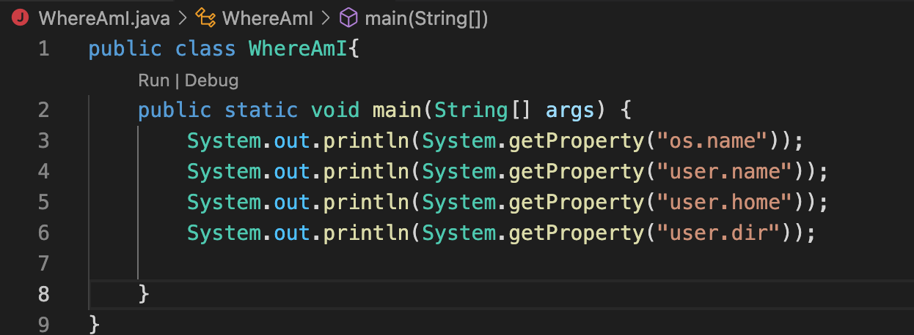 

* Run the file on *your computer* using the javac and java commands.

* Note what is printing when the "WhereAmI" class is run on *your* computer.
  * 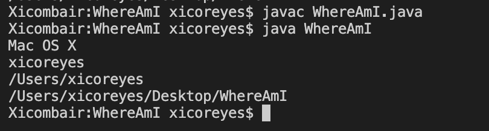

* Now, to begin moving the file, run this command in your temrinal from the directory where you made this file
  * scp < WhereAmI.java > cs15lsp22zz@ieng6.ucsd.edu:~/

  * where < WhereAmI.java > is the file you wish to move.

* You will be prompted for a password similar to when you logged in with ssh. Input your password and the file is now moved.
  * 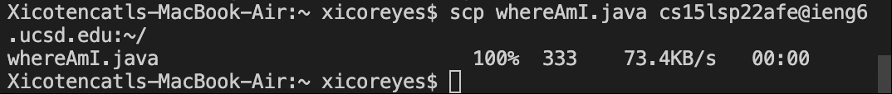

* To verify this, you can once again log into ieng6 with ssh again as described in the **Remotely Connecting** Step and use the "ls" command to see the moved file in the directory.

* Now you can run the file using javac and java in the *ieng6 computer*. (As it is now in the *ieng6 computer shown by using the command ls)
  * 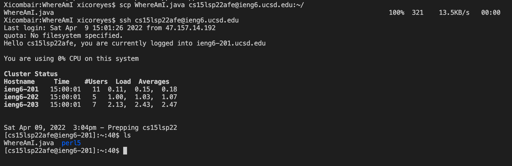

  * Note what is now printed in for the example "WhereAmI" class:

  * 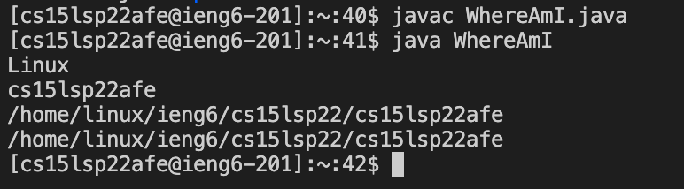

## Setting an SSH Key

### Explanation
* To avoid reinputing your password every time you log into ssh or move a file you can use the *-ssh keys*; ssh keys is a program that creates a pair of files called the "public key" and "private key." Using this, you can copy the public key and private key to a particular location on the server, and a particular locatin on the client (your computer) respectively. 

* Following this, the ssh command can now use the pair of files in place of  your password.

### How to do it

* On the client (your computer), input the command
  * $ ssh-keygen
  * Enter your own username where it prompts you to "Enter file in which to save the key:"

* Do not add a passphrase this time, instead, press enter twice. 
  * Something like this should be displayed:
  * 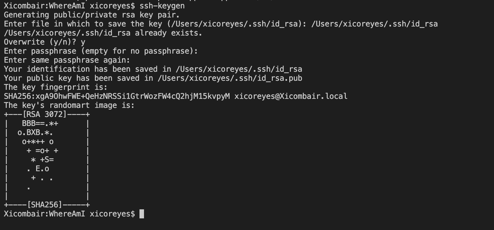

* Note: If you are on Windows, follow the extra "ssh -add" steps [here](https://docs.microsoft.com/en-us/windows-server/administration/openssh/openssh_keymanagement#user-key-generation) **or** do command
  *  ssh-keygen -t ed25519

* Now, the private key (in a file "id_rsa") and the public key (in a file "id_rsa.pub") are stored in your system in the .ssh directory. 

* Now copy the *public* key to the .ssh directory of your user account on the server using
  * $ ssh cs15lsp22zz@ieng6.ucsd.edu
  * Enter your password.

* Now on the server, do input this command.
  * $ mkdir.ssh
  * < logout >

* Now logged-out and back on the client input the command.
  * $ scp /Users/< user-name >/.ssh/id_rsa.pub cs15lsp22zz@ieng6.ucsd.edu:~/.ssh/authorized_keys
  * Where < user-name > is your individual username on your computer.
  * 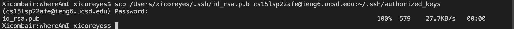

* Once this is done, you can now ssh or scp from *this* client to the server without entering your password. 
  * 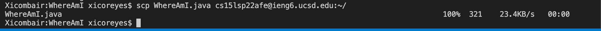

## Optimizing Remote Running

### To optimize Remote running you can 
* write commands in quotes at the end of an ssh command to run it on the remote server then exit. 
 
* Use semicolons to run multiple commands on the same line in most terminals. 

* Use the up-arrow on your keyboard to recall the last command that was run

* Ex: 
  *  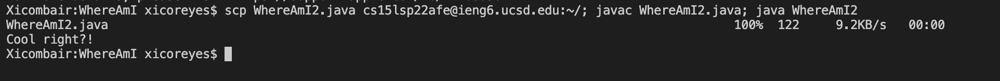

