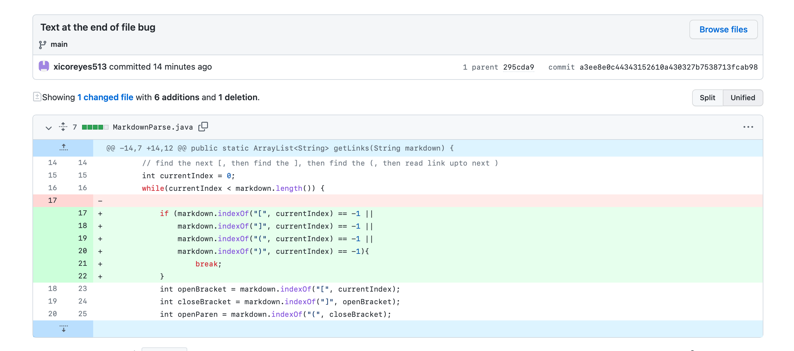
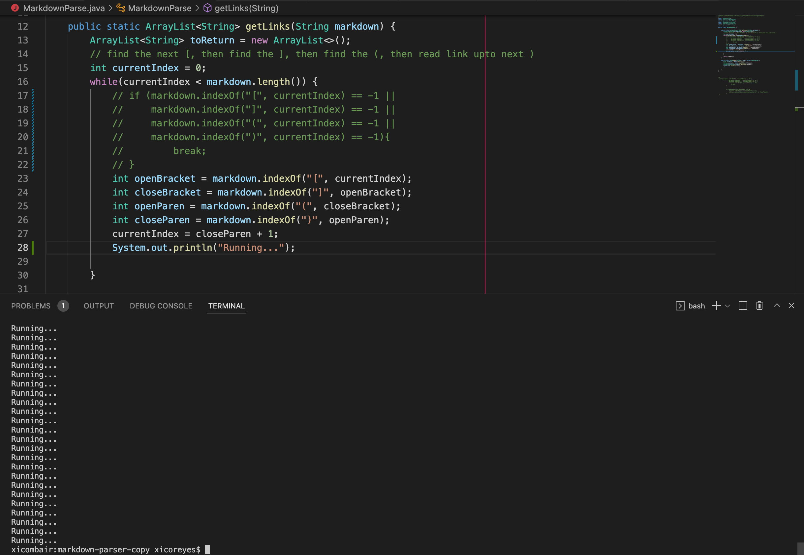
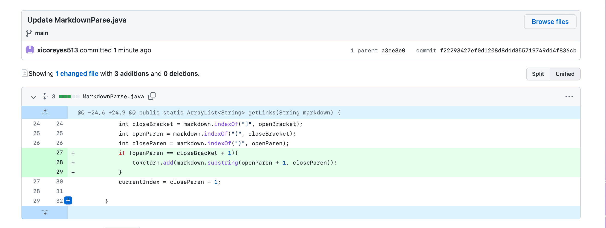
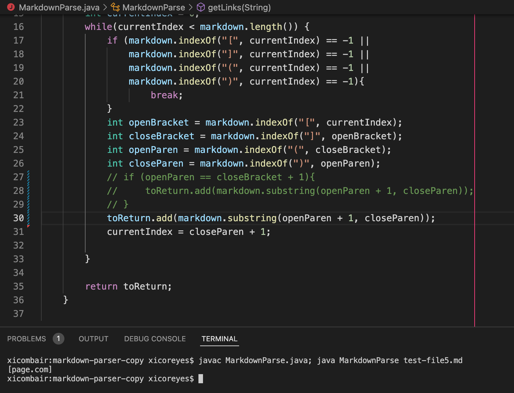
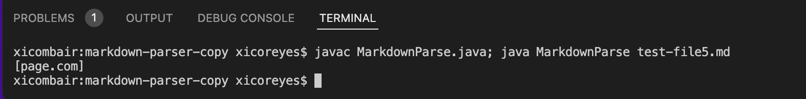
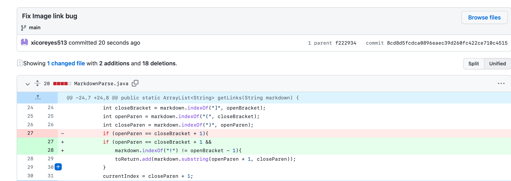
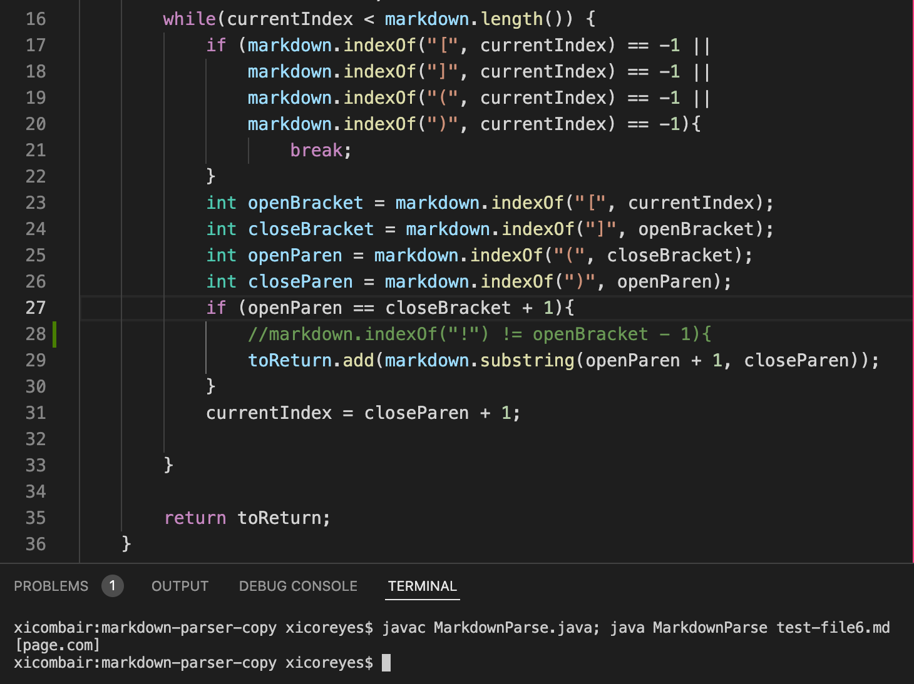
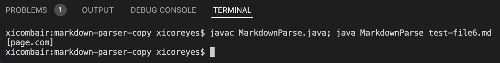

# Lab Report 2

## Bug 1 - File Ending with Text

* Code change diff:

  * 

* Link to test file for the *failure-inducing input* that prompted the change
  * [Link to test file](https://github.com/xicoreyes513/markdown-parser-copy/blob/main/test-file2.md)

* Symptom
  * 
  * Note: A print line was added so that the infinite loop symtpom is more apparent. 
* Relationship between bug, symptom, and failure-inducing input
  * This first bug has to do with the fact that there is no if statement to catch the case where the markdown file ends with text, and not a link. Thus, this causes the symptom of:the while loop continuing to run as long as there is more text in the markdown file. This causes an infinite loop as the failure inducing input: test-file2.md has "Some paragraph text after the links" and so, the while loop that depends on currentIndex being less than the markdown file length, is never false, as when the code does not find the `markdown.indexOf(")");`, `currentIndex` would become `closeParen + 1`, or -1 + 1 = 0, thus reseting `currenIndex = 0` and causing the symptom of the loop running forever. 
  * With the if statement, if the file does not contain "" after currentIndex, then the while loops stops and thus eliminates the possibility of an infinte loop

## Bug 2 - File with Space Between [] and ()

* Code change diff:

  * 

* Link to test file for the *failure-inducing input* that prompted the change
  * [Link to test file](https://github.com/xicoreyes513/markdown-parser-copy/blob/main/test-file5.md)

* Symptom
  * 
  * Zoomed in view:
  * 

* Relationship between bug, symptom, and failure-inducing input
  * The second bug is the fact lack of an if statement catching the case where there a file does indeed contain "[]" and "()", but they are not next to eachother in the form that is required for a link. The symptom is thus the later text in the "()" being added to the links ArrayList as a supposed link. For example, when the failure inducing input: test-file5.md is used to run the code, the text "(page.come)" that comes **much** after the initial "[]", is interpreted as a link and added to the links ArrayList.
  * With the if statement, the code checks if `openParen == closeBracket + 1` and if true, the code does `toReturn.add(markdown.substring(openParen + 1, closeParen));`

## Bug 3 - File with Image

* Code change diff:

  * 

* Link to test file for the *failure-inducing input* that prompted the change
  * [Link to test file](https://github.com/xicoreyes513/markdown-parser-copy/blob/main/test-file6.md)

* Symptom
  * 
  * Zoomed in view:
  * 

* Relationship between bug, symptom, and failure-inducing input
  * The third bug is the fact lack of an if statement to catch the case where the file contains the path to an image, not a link to a cite. The symptom is the code adding the image path to the ArrayList that should only contain cite links. The failure inducing input: test-file6.md has an image inserted, and so, when the code without the if statement runs, it ignores the ! before the closeBracket, and thus it adds the image path to the links ArrayList. 
  * With the if statement, the code checks if `markdown.indexOf("!") != openBracket - 1` and if true, it skips `toReturn.add(markdown.substring(openParen + 1, closeParen));` and does not add the image path to the links ArrayList a