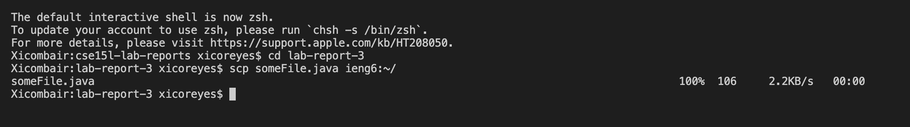
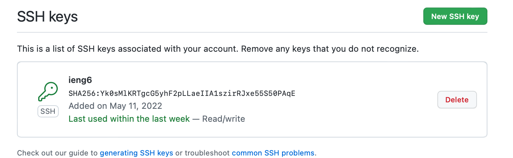

# Lab Report 3

## Stremalining ssh Configuration

* Create a config file in ssh and input the necessary lines
  * 

* Use the ssh command to log into the account now with only `ssh ieng6`
  * 

* Use scp to copy in a file. `scp < filename > ieng6:~/`
  * 

## Setup Github Access from ieng6

* Where the public key is stored on Github
  * 

* Where the private key is stored on my user account 
  * 
* Git command to commit and push a change to lab report to Github while logged into ieng6
  * 
* [Link for the resulting commit](https://github.com/xicoreyes513/cse15l-lab-reports/commit/4aad07dda70e21ceee1eb912a9cc7bf6ebd893bf)

## Copy whole directories with `scp -r`

* Copying entire markdown-parse directory to ieng6 
  * 
* Loggin in to ieng6 and compiling the tests 
  * 
* Combining `scp`, `;`, and `ssh`
  * 
