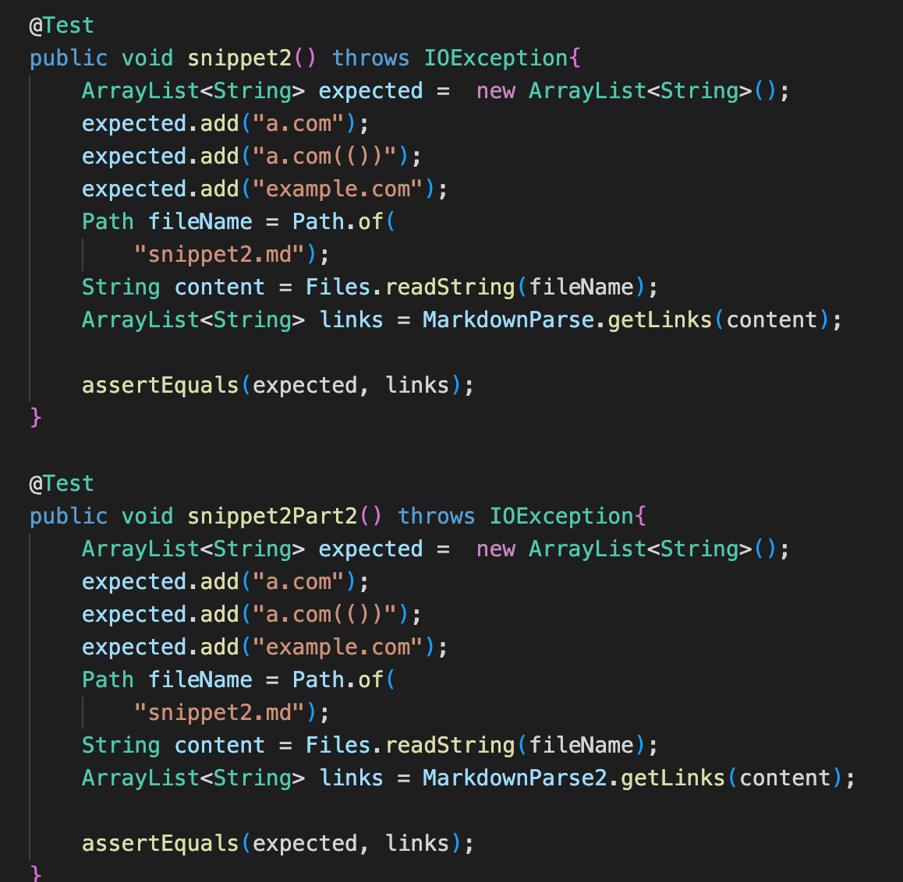
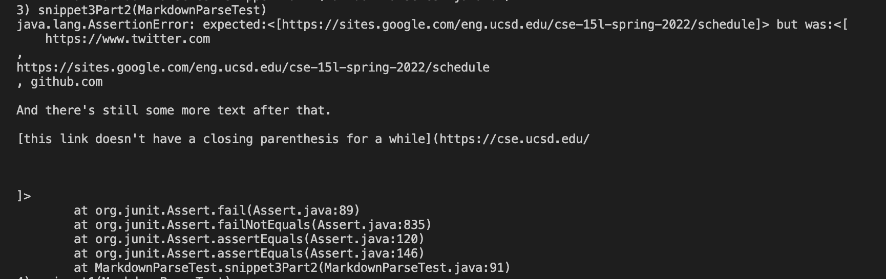

# Lab Report 4 Week 8

## Snippet 1

* This snippet should have produced ``[`google.com, google.com, ucsd.edu]``
* How this was turned into a test
  * 
* Test failing for my implementation 
  * 
* Test failing for implementation reviewed in Week 7
  * 
* I do believe there is a small code change that would make my program work for snippet 1 and all related cases that use incline code with backticks. If there was an if statement that checked if there was 1 backtick before, and 1 backtick within the brackets, then we would increment currentIndex to `lastBacktick + 1`.

## Snippet 2

* This snippet should have produced `[a.com, a.com(()), example.com]`
* How this was turned into a test
  * 
* Test failing for my implementation 
  * 
* Test failing for implementation reviewed in Week 7
  * 
* I do not believe there is a small code change that would make my program work for snippet 2 and for all related cases that nest parentheses, brackets, and escaped brackets. I believed the more involved approach would include a separate method that is called to check this case in which a stack is implemented to determine the correct index of the last parenthesis.

## Snippet 3

* This snippet should have produced `[https://sites.google.com/eng.ucsd.edu/cse-15l-spring-2022/schedule]`
* How this was turned into a test
  * 
* Test failing for my implementation 
  * 
* Test failing for implementation reviewed in Week 7
  * 
* I do believe that there is a small code change that will make my program work for snippet 3 and all realted cases that have newlines in brackets and parenthesis. I would add an if statement that checks if `markdown.contains("\n")`, if it does and this index given is smaller than the index of the next close bracket or close parenthesis, then I could increment currentIndex to the index of the next line and continue searching. 
* Note: this is done to replicate how the md files consider imbedding links, if simple urls were to be considered then there would need to be a more significant code block.