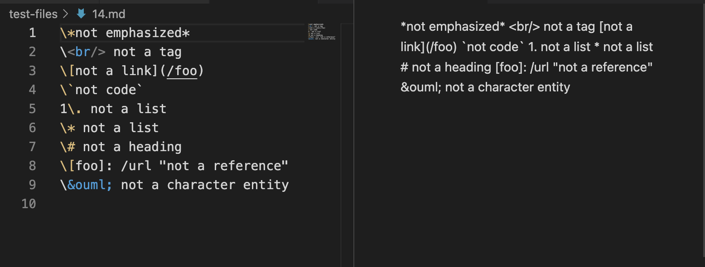
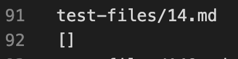
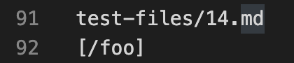
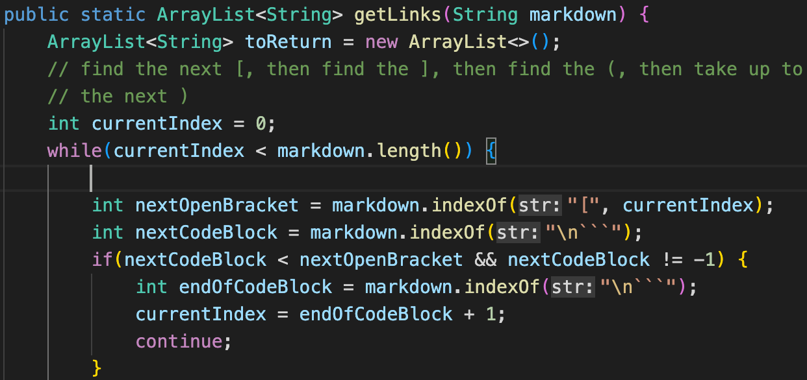
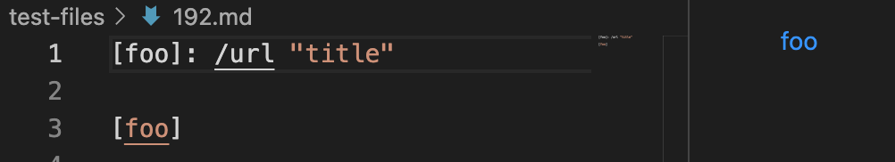
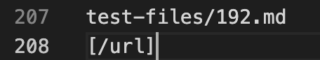
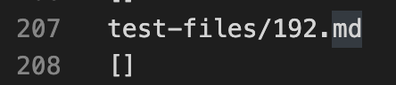

# Lab Report 5
## How Tests with Different Results were Found

* The first step was to create a bash script file in which it runs all the test files
* After this, the output of `bash script.sh` was redirected into results.txt
* This was done for my implementation and the provided implementation from this lab report
* Following this, the two result.txt files were compared using `diff` and their respective paths

## Test 1: 14.md

* [Link to test file](https://github.com/xicoreyes513/markdown-parser-copy/blob/main/test-files/14.md)

* 

* My implementation is correct, as within the file, `(/foo)` is not a link, and so, the provided implementation interpreted `/foo` as a link. The preview shows no link.

* Expected output
  * `[]`
* My output
  * 
* Provided output
  * 

* The provided implementation should contain an if statement in which if the index after `(` is `/` then currentIndex should be updated. Should be inserted here:
  * 

## Test 2: 192.md

* [Link to test file](https://github.com/xicoreyes513/markdown-parser-copy/blob/main/test-files/192.md)

* 

* My implementation is correct, as within the file, it contains `[foo]: /url "title"`. My implementation interprets this as a url, but the provided implementation does not, as the provided implementation return `[]` while mine returns `[/url]`

* Expected output
  * `[/url]`
* My output
  * 
* Provided output
  * 

* The provided implementation should contain an if statement in which it check if the index after `]` is `:`, in this case, they should just read the very next word, ending at its next space. Should be inserted here:
  * 